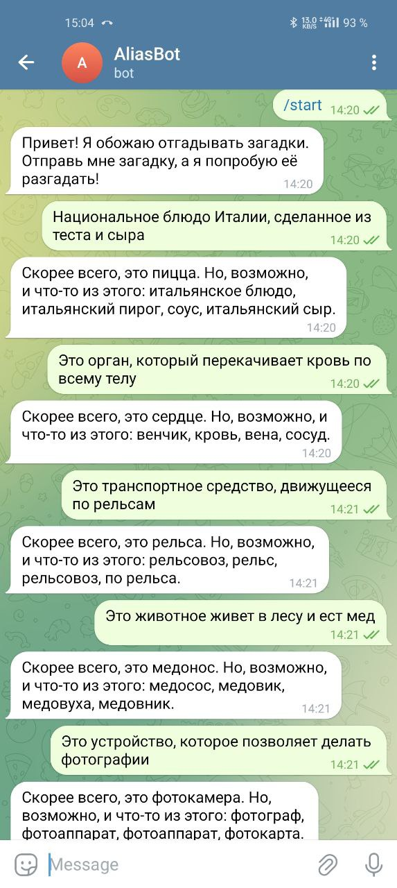

# **LoRA-Enhanced Word Prediction Service**

## **Overview**
This project implements a word-prediction machine learning (ML) service capable of solving word-based quizzes in Russian. The service is designed for asynchronous, scalable deployment and features a Python API and Telegram bot as the client interface. Key highlights of the project include training Transformers from scratch using LoRA (Low-Rank Adaptation), ML experiment tracking with WandB, and containerized deployment using Docker Compose.

---

## **Table of Contents**
- [Task Description](#task-description)
- [Dataset and Preprocessing](#dataset-and-preprocessing)
- [Model Training](#model-training)
- [Experiment Tracking](#experiment-tracking)
- [Deployment](#deployment)
- [Repository Structure](#repository-structure)
- [Steps to Deploy](#steps-to-deploy)
- [Screenshots](#screenshots)

---

## **Task Description**
The task involves predicting the correct word from a quiz prompt in Russian. The model is designed to process complex linguistic patterns, returning the most likely prediction along with alternative suggestions.

---

## **Dataset and Preprocessing**
### **Dataset**
The dataset is sourced from HuggingFace:
- **Dataset Name**: `artemsnegirev/ru-word-games`
- **Subsets Used**:
  - `350_zagadok`
  - `ostrova`
  - `ugadaj_slova`
  - `umnyasha`

### **Preprocessing**
- **Data Cleaning**:
  - Replaced ellipses (`...`) and related symbols with a standardized format.
- **Input Format**:
  - Prefixed quiz prompts with `"guess word:"`.
- **Label Filtering**:
  - Retained only examples where the answer is a noun.
- **Additional Tokenization**:
  - Tokenized both prompts and answers using `T5Tokenizer`.

---

## **Model Training**
- **Base Model**:
  - [T5 model](https://huggingface.co/docs/transformers/en/model_doc/t5)
- **Training Technique**:
  - Transformers trained with **LoRA (Low-Rank Adaptation)**, a parameter-efficient fine-tuning technique.
- **Libraries Used**:
  - `transformers` by HuggingFace.
  - `peft` for LoRA integration.
- **Experiment Tracking**:
  - ML experiments tracked using **Weights and Biases (WandB)**.

---

## **Experiment Tracking**
The training process, including loss dynamics and evaluation metrics (e.g., Exact Match), was tracked and visualized using **WandB**. This allowed real-time insights into model performance and facilitated hyperparameter tuning.

Here are the images of loss and metric dynamics during experiment tracking:  


---

## **Deployment**
### **Architecture**
The deployment consists of:
1. **Python API**:
   - Handles prediction requests via HTTP endpoints.
   - Integrated with Celery for asynchronous task processing.
2. **Telegram Bot**:
   - Acts as the client interface for users to interact with the model.

### **Containerization**
- **Docker Compose**:
  - Orchestrates multiple services (`redis`, `app`, and `telegram-bot`).
- **Redis**:
  - Serves as the task queue broker and result backend for Celery.

---

## **Repository Structure**
```
.
├── Dockerfile.app                # Dockerfile for API and Celery worker
├── Dockerfile.bot                # Dockerfile for Telegram bot
├── docker-compose.yml            # Docker Compose configuration
├── requirements.app.txt          # Dependencies for app and Celery
├── requirements.bot.txt          # Dependencies for Telegram bot
├── data/
│   └── tokenized_dataset         # Tokenized dataset for model training, with train/test split
├── models/
│   └── final_model/              # LoRA-adapted model files
├── notebooks/
│   ├── test_python_api.ipynb     # Jupyter notebook for API testing
│   └── data_preprocessing.ipynb  # Notebook for data preprocessing
├── src/
│   ├── api/
│   │   ├── app.py                # Flask API implementation
│   │   └── tasks.py              # Celery task definitions
│   ├── bot/
│   │   └── bot.py                # Telegram bot implementation
│   ├── model/
│   │   └── train_model.py        # Model training script
│   ├── preprocessing/
│   │   └── data_preparation.py   # Data preparation script
│   └── utils/
│       └── wandb_utils.py        # WanDB configuration
├── images/
│   ├── eval_loss_chart.png     # WanDB chart of loss dynamics during training
│   ├── eval_metric_chart.png     # WanDB chart of netric (Exact Match) dynamics during training
│   └── telegram_bot_replies.png  # Screenshot of Telegram bot responses
├── wandb/                        # Model run logs in WanDB UI
├── .dockerignore                 # Files/directories to ignore in Docker builds
├── .gitignore                    # Files/directories to ignore in Git push
├── .env                          # Environment variables for Docker
├── start_services.sh             # Script to start Celery and Flask
└── README.md                     # Project documentation
```

---

## **Steps to Deploy**
### **Prerequisites**
1. Install Docker and Docker Compose.
2. Clone the repository:
   ```bash
   git clone <repository-url>
   cd <repository-directory>
   ```

### **Steps**
1. **Prepare the Environment**:
   - Add your Telegram bot token to `.env`:
     ```plaintext
     TELEGRAM_BOT_TOKEN=<your-bot-token>
     ```

2. **Build Docker Images**:
   ```bash
   docker-compose build
   ```

3. **Start Services**:
   ```bash
   docker-compose up
   ```

4. **Test the Deployment**:
   - **API**: Send a POST request to `http://localhost:5000/predict`.
   - **Telegram Bot**: Interact with the bot by sending `/start` and a quiz prompt.

---

## **Screenshots of bot usage**
Here’s a screenshot of the Telegram bot in action:

